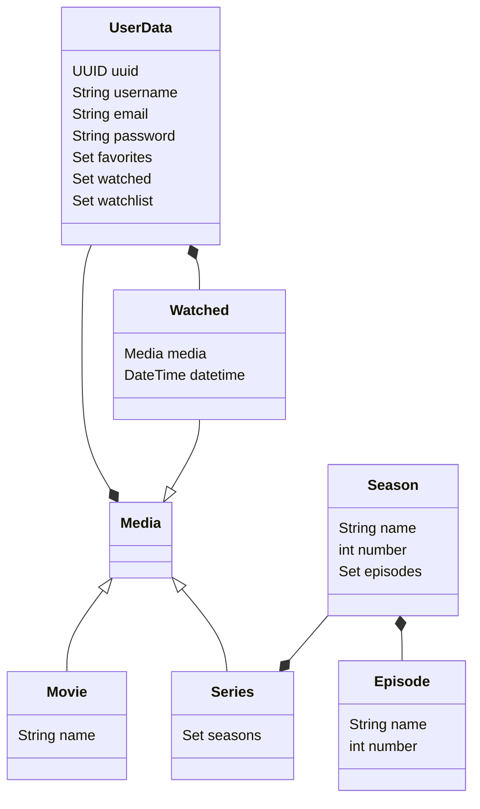

```mermaid
classDiagram
    UserData --* Media
    UserData *-- Watched
    UserData : UUID uuid
    UserData : String username
    UserData : String email
    UserData : String password
    UserData : Set<Media> favorites
    UserData : Set<Watched> watched
    UserData : Set<Media> watchlist
    
    Media <|-- Movie
    Movie : String name
    
    Season --* Series
    Series: Set<Season> seasons
    
    Season *-- Episode
    Season : String name
    Season : int number
    Season : Set<Episode> episodes
    
    Episode : String name
    Episode : int number
    
    Media <|-- Series
    
    Watched --|> Media
    Watched : Media media
    Watched : DateTime datetime
```